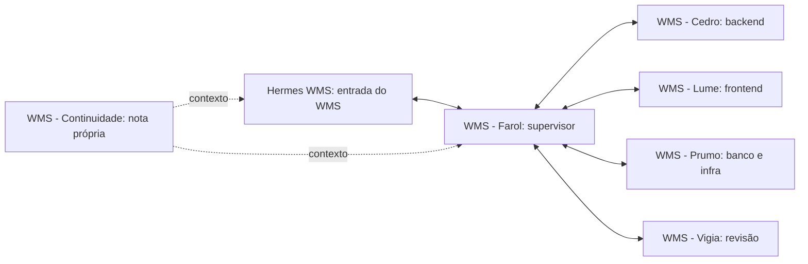

# Equipe WMS no Maestri, com Hermes próprio

Registro de 05/10/2026, referente a D14. Por orientação expressa do responsável, a equipe fica no mesmo canvas **Projetos**, ao lado do ETL v2, mas tem **seu próprio Hermes**. Os dois grupos não compartilham conexões, notas, memória, sessões ou controles de trabalho.

## Organização

As conexões permitem comunicação nos dois sentidos. Os quatro especialistas se ligam ao Farol; **Hermes WMS** se liga ao Farol. A nota própria **WMS - Continuidade** está ligada somente aos seis terminais WMS. O Hermes antigo continua pertencendo ao ETL.

| Terminal | Responsabilidade | Limite |
| --- | --- | --- |
| Hermes WMS | Receber a demanda WMS e encaminhá-la ao Farol | Perfil `wms-rodogarcia`; não usar o Hermes vizinho |
| WMS - Farol | Dividir escopo BE/FE, distribuir arquivos e consolidar resultados | Coordenação exclusiva do WMS; Maestro próprio |
| WMS - Cedro | Backend conforme contratos e MVC convencional | Java/Spring, properties e padrões do documento 16 |
| WMS - Lume | Telas e integração com contratos confirmados | React/TypeScript; regras e autorização ficam no backend |
| WMS - Prumo | Estrutura, migrations e procedimentos de ambiente | SQL Server; preparar SQL não autoriza aplicá-lo |
| WMS - Vigia | Revisão em leitura, com impacto e evidências | Não editar a aplicação por conta própria |

O cadastro com os IDs desta instalação está em [equipe.json](../orchestracao/equipe.json). Os [papéis completos](../orchestracao/README.md) mantêm a equipe **preparada, aguardando tarefa explícita**. Nenhuma ordem de implementação foi enviada nesta preparação. O backend existente deve ser preservado e retomado pelo estado atual da trilha.

## Separação do Hermes

O novo terminal executa o **Hermes instalado**, com seleção explícita do perfil `wms-rodogarcia` e pasta de trabalho `C:\Users\suporte\Documents\projetos\wms-rodogarcia`.

O perfil foi criado do zero em `C:\Users\suporte\AppData\Local\hermes\profiles\wms-rodogarcia`. Possui `SOUL.md`, memória, sessões e armazenamento próprios. Não foi clonado do perfil anterior. Seu `gateway.standalone` está habilitado e o uso de múltiplos perfis está desabilitado nessa configuração, para mantê-lo independente do gateway compartilhado. Não foi trocado o perfil padrão nem reiniciado o gateway existente.

Não foram copiados histórico, memória, ponte, hooks, rotinas, `.env`, bot Telegram ou controles do ETL. A conta de acesso ao provedor de IA pode ser reutilizada pelo mecanismo normal de autenticação do Hermes; isso não reaproveita uma conversa ou memória do outro projeto. A primeira resposta do modelo neste perfil ainda não foi validada.

A [orientação do perfil](../orchestracao/hermes/README.md) registra sua configuração e forma de retomada. Essa separação organiza o contexto da equipe no mesmo computador; não é uma barreira de acesso do sistema operacional.

## Regras de trabalho

1. Toda demanda WMS usa **Hermes WMS → WMS - Farol**. O terminal chamado apenas **Hermes** e o **Supervisor ETL** pertencem ao outro projeto.
2. Todos os seis terminais WMS têm a pasta WMS como diretório. Consultar `maestri list` e confirmar nome, papel e pasta antes de encaminhar uma tarefa.
3. Não conectar os grupos nem compartilhar suas notas. Não reutilizar agentes, banco, ponte, controles de pausa, rotinas ou recibos do ETL.
4. Durante trabalho coordenado, Farol mantém `AGENTS.md`, `states.md`, decisões e continuidade. Especialistas informam evidências e pendências. Tarefa documental expressamente atribuída pelo usuário continua autorizada.
5. Dividir os arquivos antes da execução. Se duas frentes precisarem do mesmo arquivo, Farol define a sequência; nenhuma delas sobrescreve trabalho em andamento.
6. O resultado retorna pelo canal solicitado. Se houver recibos locais, usar somente `orchestracao/.runtime/`, com identificador WMS exclusivo. Não reutilizar o protocolo de recibos do ETL.
7. Preparar a equipe não inicia código, conexão ao SQL Server, migração, emissão fiscal, publicação ou rotina automática.

## Conferência e ativação

| Conferência | Evidência da preparação |
| --- | --- |
| Seis terminais WMS | Cinco agentes Codex e um Hermes real com perfil próprio |
| Pasta dos seis terminais | WMS Rodogarcia |
| Supervisor próprio | Farol com Maestro ativo |
| Ligações internas de agentes | Farol ↔ quatro especialistas e Farol ↔ Hermes WMS |
| Nota WMS | Ligada somente aos seis terminais WMS |
| Ligações WMS ↔ projeto antigo | Nenhuma, inclusive por nota compartilhada |
| Grupo anterior | Seis terminais com nomes, pastas, papéis e posições preservados; oito conexões de agentes e duas conexões da nota antiga preservadas |
| Memória e sessões do Hermes | Perfil novo, independente do perfil usado pelo ETL |
| Primeira inicialização Hermes WMS | Aguardando escolha de privacidade `Help improve Hermes?` |
| Primeira resposta dos agentes Codex | Aguardando confirmação de confiança da pasta WMS |
| Telegram do WMS | Não configurado; nenhum bot ou destino do ETL foi reutilizado |

O usuário precisa concluir as confirmações nos **novos terminais WMS**: escolher a opção de privacidade no Hermes WMS e confirmar **Trust and continue** na pasta correta dos agentes Codex. Depois, conferir uma resposta curta por agente e o caminho Hermes WMS → Farol. Esse teste não inicia implementação e não comprova piloto ou regras operacionais. OR01 no `states.md` permanece em validação até a evidência dessas respostas.
