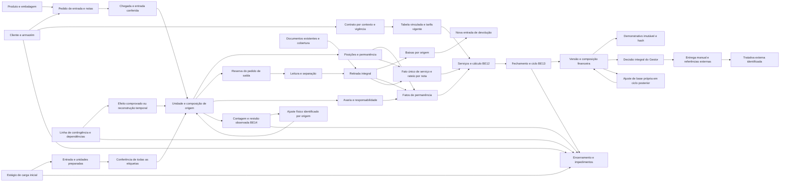

# Modelo integrado e jornadas do backend — BE01

**Modelo integrado aceito no escopo local D19.** Este documento liga os contratos existentes à jornada HTTP verificada no build367; não representa homologação externa ou frontend entregue. Status e evidências permanecem em [states](../states.md) e na [matriz final](34-matriz-e-validacao-final-backend.md). Regras recebidas e propostas AC01–AC16 continuam nos documentos [10](10-respostas-recebidas-2026-10-05.md) e [11](11-alinhamentos-apos-respostas.md).

## Relações e limites

O vínculo cliente/armazém delimita propriedade e alcance. Produto define unidade e precisão; embalagem/DUN define configuração e conversão declarada. A unidade logística tem identidade própria. Composição referencia entradas conferidas, preservando nota, lote aplicável, chegada e FIFO. Posição representa ocupação física; permanência representa o intervalo e a equivalência usados no cálculo proposto. Documento de mercadoria, reserva, condição física e fechamento são fatos distintos.

Cada contrato abaixo define seus próprios DTOs, transições e limites. A ligação integrada não concede emissão fiscal, preço implícito ou liberação de estoque.

O [contrato29](29-cadastros-servicos-e-calculo.md) foi aceito localmente no freeze292, conforme [30](30-validacao-servicos-e-calculo.md). Liga catálogo/tabela/item/vínculo ao cliente/armazém e sua vigência. Fato de serviço referencia a execução comprovada e suas notas; rateio reparte esse fato, sem repetir o total. Cálculo guarda memória diária e de serviços como snapshot, ligado aos fatos e parâmetros usados. Marco financeiro de avaria liga ocorrência ao evento de mudança, sem alterar estoque. Fechamento/versionamento BE13 do [contrato31](31-fechamento-contagem-e-contingencia.md) aceito localmente com333 testes/revisão no32. Contagem/conciliação BE14 aceitas localmente no fecho D19, conforme32.

| Ligação do contrato29 aceito no recorte local | Dados que conserva | Efeito delimitado |
| --- | --- | --- |
| Complemento fiscal → cliente/armazém/produto | Identidade original, contexto da referência, revisão, fonte e auditoria | Atualiza referência declarada; não autoriza emissão ou muda proprietário/documento |
| Prévia Excel → confirmação → endereços | Armazém, hash, layout, linhas/erros e confirmação original | Cria lote integral revalidado; não ocupa posição nem cria conjunto, unidade ou estoque |
| Execução → fato de serviço → parcelas por nota | Chave do fato, instante executado, unidade tarifária, origem e cotas | Uma execução não se multiplica por UUID, nota ou posição; anulação mantém o vínculo histórico |
| Contrato/vínculo/tarifa → cálculo/memória | Vigência, fuso, dias, regras/categorias, fatos e parâmetros do snapshot | Ausência necessária gera pendência; novo cálculo não reescreve o anterior nem fecha ciclo |
| Avaria/fato de permanência → marco financeiro | Quantidade e equivalência históricas, destino comprovado, responsabilidade e justificativa | Suspensão financeira não altera saldo, reserva, localização ou condição original |
| Movimento BE08 → ocorrência/ciclo detalhado → cálculo | Movimento AVARIA_ESTOQUE imutável, instante, snapshot anterior e ocorrência/ciclo comprovados pelo AVARIA_DETALHADA posterior | Dado financeiro desconhecido produz pendência/total PENDENTE. Lacuna anterior não desaparece pelo reparo; ciclo antigo não cobre dano novo |

As transições implementadas no29 permanecem separadas: prévia com erro não pode ser confirmada; fato anulado conserva a execução; vigência encerrada preserva o preço anterior; cálculo COMPLETO/PENDENTE não é aprovação de fechamento. Ligações conferidas pelos52 testes financeiros/fiscal/Excel e parecer favorável Vigia, conforme30. A tabela acima descreve os contratos; sua evidência é o código/testes, sem aprovação comercial presumida. Versão de aprovação, corte e ajuste constam do31 refinado antes dos respectivos ajustes Java BE13. Clean verify333/0/0/0 e41 cenários BE13 aprovados no32 após três P2; freeze333/251 conferido, Vigia favorável e V8/JPA compatível; BE13 aceito localmente no32.

| Ligação BE13 aceita localmente no contrato31 | Dados que conserva | Efeito delimitado |
| --- | --- | --- |
| Cliente/armazém/contrato → fechamento/ciclo | Âncora nominal, cortes contíguos, dias e fatos únicos pela identidade do fechamento | Corte financeiro não encerra permanência; rejeição/reabertura não libera dias/fatos para duplicação |
| Cálculo e ajustes → versão → demonstrativo | Núcleo financeiro, base própria, ajustes recebidos e bytes UTF-8/hash capturados | Decisão e estado externo são metadados; documento entregue não muda por consulta ou referência posterior |
| Versão aprovada → entrega manual → referência/tratativa externa | Versão/hash entregue, todas as referências existentes e comprovações identificadas | Entrega não prova emissão; NFS-e tardia permanece na versão original e conflito bloqueia finalização incompatível |
| Correção comprovada → ajuste → composição posterior | Origem, última base própria, delta, destino e versão de aplicação | Ajuste recebido não integra a base própria; aplicação ocorre somente na finalização comprovada da composição atual |
| Tratativa → regularização de ajuste VALIDADO | Atribuição anterior/nova, snapshots/vínculos históricos e auditoria atômica | Ausência na composição impede finalizar; somente VALIDADO pode seguir para destino posterior apto, APLICADO não transfere e vínculo histórico não autoriza aplicação em outro destino |
| Tratativa de base externa → ajuste REGULARIZACAO_ORIGEM | Versão-base anterior/selecionada, lista exata de deltas de todas as versões, diferença própria e destino posterior identificado | Preserva deltas VALIDADO/APLICADO anteriores; troca100→80 com−20 já gerado cria+20 identificado, pendente até aplicar. Cadeia normal por fechamento exclui regularizações e conserva sua última base corrigida |

Gestor identifica resolução financeira de compromisso existente no mesmo contexto e período aplicável antes do replay; a auditoria guarda sua referência recuperável. O caminho histórico durante encerramento/INATIVO não reativa cadastro nem cria execução física futura. Consultas financeiras e metadados continuam com Supervisor/Gestor no alcance. A API do31 separa GET da versão, GET do demonstrativo guardado e histórico de tratativas; os comandos de entrega/declaração/referência/tratativa não fazem envio, emissão ou cancelamento externo. Esquema e diagrama descrevem os contratos; aceite local BE13 registrado no32; integração com BE14 aceita localmente no fecho D19, conforme32.

O complemento BE14 do31 foi formalizado antes do Java e aceito localmente após P2-locks, conforme32. A contagem liga unidade, revisão do conteúdo, quantidade observada e reserva existente; seu ajuste aponta as origens conservadas e o movimento responsável. O estágio inicial liga revisões de dados à entrada preparada uma única vez e à conferência posterior das etiquetas. Não soma estágio e entrada como dois estoques. A linha de contingência conserva identidade global, conteúdo original e dependências, ligando o resultado operacional sem repetir um efeito registrado. Essas relações do diagrama são desenho do contrato, com implementação/testes/revisão locais registrados no32.

O encerramento consulta compromissos físicos e a composição financeira atual. Resolução de remanescente identifica um pedido e, quando aplicável, sua carga preparada; não concede disponibilidade geral. Encerrar o trecho futuro de uma vigência conserva as configurações e snapshots anteriores. Os contratos de comandos, perfis, referências, impedimentos e transições permanecem no31; testes e revisão locais estão registrados no32, sem transformar esse modelo em evidência de execução.

| Jornada ligada ao frontend futuro | Contrato responsável | Ponto de integração |
| --- | --- | --- |
| FE02/FE03 base e acesso | [12](12-base-e-contratos-backend.md), [14](14-cadastros-acesso-e-persistencia.md), [16](16-padroes-de-engenharia-backend.md) | Problem Details, identificação, JWT e validação nos serviços |
| FE04 cadastros/endereço | [14](14-cadastros-acesso-e-persistencia.md), [29](29-cadastros-servicos-e-calculo.md) aceitos no recorte local | Proprietário/revisão, referência fiscal contextual, prévia/erros por linha e confirmação Excel, perfis/erros específicos, configuração sem alterar significado histórico |
| FE05 recebimento | [18](18-recebimento-e-conferencia.md) | Previsto, chegada, conferido, quarentena e efetivação única |
| FE06 unidade/etiqueta | [20](20-unidades-logisticas-e-etiquetas.md) | Composição conservada, UUID e revisão do conteúdo |
| FE07/FE08 posição/estoque | [22](22-enderecamento-movimentacao-e-estoque.md), [24](24-pedido-saida-fifo-e-reserva.md) | Capacidade, físico/disponível/reservado/bloqueado e histórico |
| FE09 pedido/FIFO/reserva/separação | [24](24-pedido-saida-fifo-e-reserva.md) e [27](27-separacao-retirada-retornos-e-avaria.md), aceitos localmente | Pedido integral, escolha excepcional autorizada, reserva sem vencimento e leitura/separação |
| FE10 documentos/retirada/retornos | [27](27-separacao-retirada-retornos-e-avaria.md), aceito localmente | Cobertura documental, baixa somente na retirada, devoluções e avaria |
| FE11 serviço/fechamento | [29](29-cadastros-servicos-e-calculo.md) e recorte BE13 do [31](31-fechamento-contagem-e-contingencia.md) aceitos localmente | Fatos únicos, configuração/vigência, pendências/memória; ciclo, decisão integral, versão/demonstrativo e registro da comprovação externa BE13; sem frontend ou homologação fiscal/comercial |
| FE08 consultas | [22](22-enderecamento-movimentacao-e-estoque.md), [24](24-pedido-saida-fifo-e-reserva.md) e complemento BE14 do contrato 31 a completar | Filtros, indicadores, saldo e rastreabilidade |
| FE12 contagem/contingência/relatórios | Complemento BE14 do contrato 31 a completar | Carga inicial, contagem/conciliação e ajuste identificado ligado a entradas, unidades, movimentos e reservas |

Nenhuma tela frontend foi iniciada em D19. Contrato disponível não significa jornada completa no navegador/coletor.

## Quantidades e datas

Quantidades de produto são decimais exatos na unidade base do SKU, até `decimal(19,6)`, limitadas também pela precisão cadastrada. Produto contado não admite fração indivisível. Quantidade por embalagem, conteúdo atual da unidade, quantidade reservada e posições equivalentes não são intercambiáveis. Valores da mercadoria vêm da nota; ausência permanece explícita. O contrato29 implementa preços/equivalências em19,6, componentes monetários em19,2 e arredondamento HALF_UP documentado/testado no30. Ausência comercial aparece na memória como pendência, sem se tornar preço zero.

Instantes técnicos são UTC com microssegundos; chegada recebe ISO-8601 com fuso. Emissão/validade são datas sem horário. Data FIFO, chegada real, `primeiroEnderecamentoEm` e `inicioArmazenagemEm` são campos separados. Primeiro endereço pode ser triagem/quarentena; início de armazenagem é a primeira entrada em ARMAZENAGEM. Chegada em 01/09, triagem em 02/09 e armazenagem em 03/09 conservam esses três marcos sem equivalência implícita entre eles. Separação, retirada e reconhecimento de avaria também são fatos próprios. O contrato29 descreve calendário/vigência/corte com fuso civil configurado; AC04/AC07 continuam convenções propostas até validação real.

O saldo histórico D18 reconcilia `físico total = pendente de unitização + físico unitizado` e `físico unitizado = disponível + reservado + bloqueado`. Remanescente protegido de pallet parcialmente reservado não é prometido a outro pedido. Avaria posterior bloqueia a expedição e mantém o compromisso até resolução identificada. Retirada e ajustes BE14 devem conservar a reconciliação no mesmo commit, com testes antes do aceite.

## Confirmação, repetição e consulta

Controllers recebem DTOs; serviços verificam papel e cliente/armazém, versão, estado e quantidades atuais. Uma operação confirma juntos os efeitos que não podem ficar pela metade e sua auditoria. Nos comandos cujo contrato guarda resposta idempotente, mesma chave com mesmo conteúdo retorna a confirmação original, após autorização atual; conteúdo divergente conflita. Para conhecer o estado posterior a outros comandos, consultar o recurso atual: replay não é atualização da confirmação histórica.

O recebimento anterior do [contrato18](18-recebimento-e-conferencia.md) tem comportamento próprio preservado: repetir o UUID da chegada com o mesmo comando retorna o **resumo atual** do pedido, sem nova chegada ou auditoria, inclusive após efetivação/estorno. Repetir o mesmo XML na mesma nota também retorna o resumo sem duplicação; os demais comandos desse contrato podem recusar repetição por versão/situação. Essa exceção não altera os snapshots de reserva, expedição, financeiro ou contingência nem permite executar novamente o fato físico. Lume identificou a divergência documental às06:58 de06/10; Farol conferiu o retorno existente em RecebimentoService.registrarChegada antes de delimitar a redação, sem alterar Java ou o contrato18.

Consultas existentes usam páginas desde zero, tamanho padrão 20 e máximo 100, ordenação estável por ID e filtros de contexto conforme cada contrato. DTOs delimitam dados; API não expõe entidades. Erros seguem Problem Details com `codigo` e `idOperacao`: 400 contrato/precisão, 401 ausência ou invalidade de autenticação, 403 função/alcance, 404 recurso inexistente e 409 conflito de revisão/estado/saldo/repetição. Os novos contratos precisam manter e completar filtros concretos, consultas de pendências e origem de ajustes, preservando o documento original, sem acesso direto ao banco pelo frontend.

## Conferência integrada restante

Após a entrega BE14 do contrato31, completar transições e jornadas de contagem/carga/contingência/encerramento no modelo. Serviço/tabela/cálculo29 e fechamento BE13 já aceitos localmente; sua integração final com BE14 continua pendente. Conferir um percurso inteiro fictício: entrada em partes → unidade/etiqueta → armazenagem → reserva parcial de pallet para pedido integral → separação/documento → retirada/remanescente → serviço/cálculo/fechamento. Conferir também retorno, avaria, ajuste com reserva e encerramento. A evidência deve referenciar testes realmente executados e revisão de Vigia; diagramas e exemplos documentais não são execução.

H2 não comprova migrations/dialeto/índices/CHECKs/locks SQL Server. Provedor, equipamentos, parâmetros comerciais e fiscal reais têm donos externos na [matriz 34](34-matriz-e-validacao-final-backend.md). Nenhuma ausência externa é preenchida por suposição.

Conferência documental Lume em06/10 às02:45: fiscal/identidade, importação, datas distintas, FE04/FE11/FE12 e401 coerentes com29/30 aceitos292, sem nova lacuna material no recorte. Redações49/68/82 que tratavam29 como futuro foram corrigidas por Farol e relidas por Lume; não permanecem pendentes. Apoio somente em leitura, sem arquivos/build/testes ou homologação comercial. Integração BE13/BE14 e validação do percurso completo ainda seguem a execução D19.

Lume releu somente as novas ligações BE13 em06/10, antes do aceite333: ciclo/dias/fatos, bytes/hash versus metadados, referências/tratativa, base própria versus ajustes recebidos e destino atual da aplicação coerentes com31. Não identificou lacuna material adicional; naquela leitura FE11 aguardava aceite BE13, FE12 o complemento BE14 futuro. Conferência documental não revisa Java/testes nem aprova condições comerciais/fiscais. O aceite local BE13 posterior está no32; BE14 complementado no fecho local D19, conforme32.

Complemento FE08/FE12 em06/10: o [quadro de consultas do31](31-fechamento-contagem-e-contingencia.md) formaliza listas/detalhes/revisões de contagens e cargas, linha/dependência/pendência de contingência e impedimentos de encerramento. Filtros de contexto são concretos no contrato; indicadores paginam por SKU e estoque por unidade/código/endereço/situação. Página0, padrão20, máximo100; ID/número estáveis. O replay conserva confirmação histórica, e GET do recurso mostra revisão/estado atual. Lume apontou essa lacuna às05:43; Cedro formalizou antes do Java. As consultas foram implementadas/testadas e aceitas no fecho local D19; frontend não entregue.

Releitura Lume às06:07: lacuna fechada no desenho31/35, sem residual material nesse recorte; papéis/alcance e o exemplo L2 PENDENTE→CONCILIADA explícitos. Leitura contratual não comprova implementação ou jornada frontend.

Integração parcial comprovada às06:46:08 de06/10:117/0/0/0 na bateria físico-financeira, incluindo10 cenários novos da JornadaBackendIntegrationTest. O percurso HTTP integra entrada em partes, etiquetas/armazenagem, pedido integral com parcial de pallet, separação/documentos/retirada/remanescente, fato único/cálculo/fechamento e resolução de contagem/carga/encerramento nos cenários exercitados. Instantes físicos e técnicos, replay original/GET atual e fim físico por ajuste a zero foram conferidos. Evidência e limites no32; clean verify completo, freeze e revisão final BE14 concluídos posteriormente no fecho local D19 abaixo. Não comprova frontend nem homologação externa.

**Validação integrada final D19:** 367/0/0/0,17 XMLs/JAR/289 hashes, revisão Vigia favorável às07:58; P2 do alvo/locks de CONTAGEM corrigido e testado nas duas ordens, com referências/contextos aninhados conferidos antes dos efeitos. Jornada13 própria preservada; consultas FE08/FE12 e contratos por perfil/alcance disponíveis, sem telas entregues. SQL Server/provedor/fiscal/comercial/equipamentos permanecem externos conforme33/34.

## D30 — fronteira numérica destinada ao frontend futuro

Adenda técnica de07/10/2026, em verificação D30, sem início do frontend e sem mudança do formato JSON existente. A auditoria em leitura de Lume propôs dois contratos de consumo: `D30-L-CONTRATO-LONG-JSON-001` e `D30-L-CONTRATO-DECIMAL-JSON-001`. As provas locais de Long/Decimal do focal01 receberam [parecer Vigia favorável delimitado](../orchestracao/.runtime/d30-vigia-parecer-focal01-02.json), somente nos DTOs, serviços simulados e rotas exercitados; não abrangem todos os campos, JWT, frontend ou SQL Server. A disposição integral e a regressão final continuam na [matrizD30](../orchestracao/.runtime/d30-matriz-aceite-local.json); esta redação não concede aceite integral nem altera as propostas comerciais AC.

IDs e revisões definidos como `Long`/`long` devem conservar o inteiro original entre o JSON e o backend. O consumidor futuro deve preservar os lexemas inteiros antes de qualquer conversão que perca precisão; não deve transportar IDs ou versões grandes por uma representação numérica inexata. Isso não impõe que o backend passe a usar strings JSON ou restrinja o domínio Long. Os casos locais propostos incluem `9007199254740993` e `9223372036854775807`, sem usar double como oráculo, e a recusa segura de `9223372036854775808` na entrada. Os limites de positividade e nulabilidade continuam os do campo e da rota concretos. O teste Java do contrato não valida um parser do frontend que ainda não existe.

Quantidades, equivalências e preços usam o domínio decimal definido por cada contrato; não são substituídos por ponto flutuante binário. Componentes em19,6 e19,2 devem manter coeficiente e escala significativos para o valor entre JSON e BigDecimal. O consumidor futuro deve receber, guardar, formatar e enviar o valor exato, distinguindo `null` de zero; pendência comercial não recebe valor zero por conveniência da tela. A notação exponencial exata é válida quando o contrato não exige formato fixo. Limites candidatos de teste são quantidade `9999999999999.999999` e componente monetário `99999999999999999.99`, além de excesso de inteiros/fração e ausência nos campos que a permitem. Validação400 e chamada ou ausência de chamada ao negócio precisam de evidência por DTO/rota, sem inferir que toda resposta monetária tenha as mesmas anotações de entrada. Arredondamento financeiro HALF_UP continua no componente previsto pelo contrato29; a tela não recalcula nem corrige o total do backend.

Qualificação de rastreabilidade `D30-L-DOC-ORACULO-CT24-L049-01`: o [contrato24](24-pedido-saida-fifo-e-reserva.md) exige HTTP201 e confirmação original na criação do pedido, inclusive replay. A referência histórica D29 `CT24-L049-01` acrescentou Location ao seu oráculo derivado, mas a linha49 citada não o exige. Para D30, o oráculo é201/confirmação original/replay; ausência de Location não constitui defeito desse requisito. O derivado e os recibos D29 permanecem preservados. A [qualificação versionada](../orchestracao/.runtime/d30-farol-adenda-contratos-numericos-e-location.json) identifica as fontes e seus hashes.

## D30 — associação posterior de adicional e inteiros na entrada

Adenda técnica de07/10/2026, ainda em validação local. RN09.01, V40.02 e AC09.06 compartilham o mesmo caso de associação futura; AC09 permanece proposta, sem aceite comercial. Não há nova rota, DTO, tipo de operação ou migration: `POST /api/v1/fatos-servico` recebe o `FatoServicoDto.Registrar` existente, e `pedidoSaidaId` conserva seu tipoLong opcional.

O registro imediato do ADICIONAL guarda a execução e suas origens mesmo quando a saída ainda não existe. Para associar uma saída posterior, o comando usa outra `operacaoId` e identifica a mesma execução, conservando os demais dados e cotas. O service admite somente um fato ADICIONAL CONFIRMADO ainda sem saída e uma saída real de contexto compatível. Quando há produto no fato, a saída deve conter esse produto. Alterar os demais dados, substituir uma saída já vinculada ou reaproveitar a chave de operação com conteúdo divergente não constitui essa associação.

A resposta200 da associação mantém o ID do fato, acrescenta `pedidoSaidaId` e aumenta a versão. Execução, quantidade, valorBase, categoria, origens e cotas não são registrados novamente. O replay do primeiro registro continua devolvendo seu snapshot original; o replay da associação devolve o snapshot associado. A consulta atual do fato permite ao consumidor futuro distinguir o estado corrente desses retornos históricos. A permissão e o alcance são verificados no backend; a tela não cria a saída nem decide a cobrança.

O [recibo Cedro v02](../backend/evidencias/d30-cedro-associacao-futura-recibo-v02.json) separa fixture17, red funcional18, comparação de representação19 e green20 de um caso local HTTP+H2. O green conserva os16campos delimitados, valores/cotas, linha do fato exceto FK/versão,61outras tabelas e replays nos predicados exercitados. Revisão independente, rollback tardio, outros ramos de dados/SKU e regressão final na última fonte continuam pendentes. H2 e leitura de annotations não provam materialização, driver, locks ou atomicidade no SQLServer.

Nos campos declarados como `Long`/`long` ou `Integer`/`int`, uma entrada fracionária não pode ser truncada e enviada ao negócio como outro inteiro. [Long12–13](../orchestracao/.runtime/d30-vigia-coercao-long-focais12-13-conferencias.json) e [Integer14–15](../orchestracao/.runtime/d30-vigia-coercao-integer-focais14-15-conferencias.json) têm parecer independente favorável somente aos negativos concretos: após a correção local, recebem400 sem chamada ao serviço nos controllers/DTOs testados. O módulo vigente inclui Long/Integer; o green Long13 usou a versão anterior, distinguida nos recibos. Os demais tokens, nulos, inteiros exatos, overflow e contratosDecimal precisam da regressão final na última fonte. Esta regra não muda o formatoJSON, o domínioLong, os limites de cada atributo ou a distinção entre null e zero; não aceita todos os campos por inferência.

## Qualificação técnica D30 dos defaults de avaria

Em `AvariaDto.Registrar.resolverPendentes` e `AvariaDto.Reparar.resolverPendentes`, o construtor compacto transforma o argumento Java `NULL` em `false`; valores explícitos `true` e `false` permanecem. Esse default efetivo é específico desses dois componentes, além do tipo de referência `Boolean`. A declaração genérica de nullabilidade/default JVM não descreve sozinha a transformação do construtor.

A fonte produtiva `backend/src/main/java/br/com/rodogarcia/wms/dto/AvariaDto.java`, SHA `C2D45E278CD701940B10F40F3028B4DB2B882BD0321020AAB9D7F691DFC2712F`, contém as cláusulas nas linhas32 e51. O [batch independente Vigia](../orchestracao/.runtime/d30-vigia-batch-atributosDTO1373-001-v01.json) identifica separadamente os atributos `D30-L-ATR-6183379CD72079FE` e `D30-L-ATR-824752110638E1E4`. Trata-se de qualificação técnica estática; binding de JSON omitido/NULL, validação, permissões, replay e efeitos de cada caller ainda exigem provas pertinentes na última fonte. O construtor de Registrar não aceita automaticamente os ramos de Reparar. Nenhuma nova norma de negócio, execução frontend, aceite comercial ou SQL Server decorre dessa qualificação.
